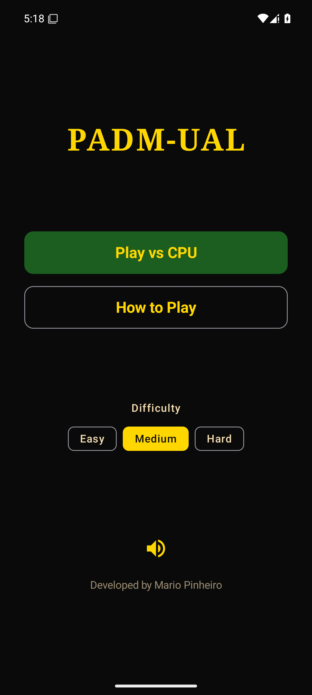
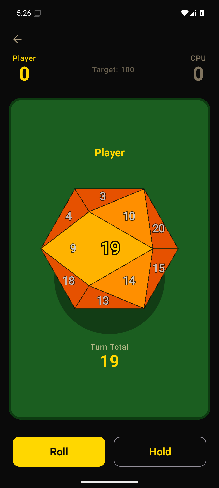
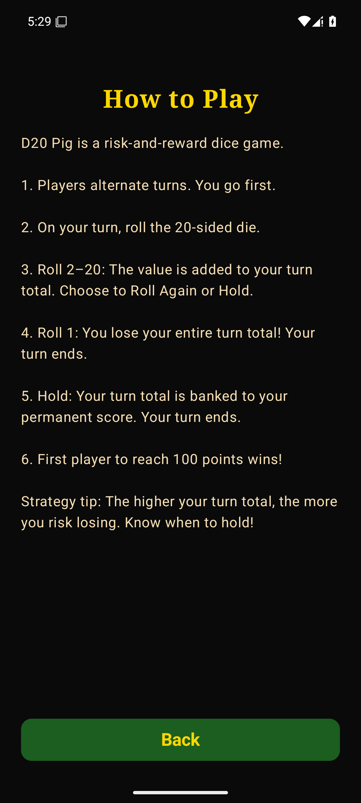
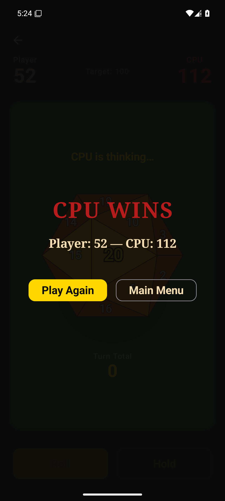

PADM-UAL
========

A casino-themed **D20 Pig** dice game for Android, built with Kotlin and Jetpack Compose.

> Coursework for **Advanced Mobile Device Programming**, Masters in Computer Engineering & Telecommunications.
> Originally bootstrapped from Google's [Dice Roller codelab](https://developer.android.com/codelabs/basic-android-kotlin-compose-dice-roller) sample app.

---

## Gameplay

1v1 push-your-luck game against a CPU opponent. First player to **100 points** wins.

- Roll the d20 to add to your **turn total**.
- **Roll 2–20:** add to turn total. Choose to **Roll Again** or **Hold**.
- **Roll a 1:** lose your entire turn total. Turn passes to the opponent.
- **Hold:** bank the turn total into your permanent score and pass the turn.

---

## Screenshots

<table>
  <tr>
    <td align="center"><br><b>Main menu</b><br><sub>Play vs CPU, rules, difficulty</sub></td>
    <td align="center"><br><b>Gameplay</b><br><sub>3D d20 landed on 19, turn total banked</sub></td>
    <td align="center"><br><b>How to play</b><br><sub>In-app rules screen</sub></td>
    <td align="center"><br><b>Game over</b><br><sub>Winner overlay with final score</sub></td>
  </tr>
</table>

---

## Features

- Real **3D icosahedron** rendered on `Canvas` with perspective projection — all 20 faces visible, with proper face-orientation math so the rolled number lands facing the camera.
- **Tumble & land** animation with cubic easing; rolled face glows gold after settling.
- **Shake-to-roll** via accelerometer with a lifecycle-aware listener — equivalent to tapping ROLL when it's enabled.
- **Haptic feedback** on land and on win.
- **Sound effects** (roll, land, banked, turn-lost, win, lose, CPU thinking) generated as PCM tones at the device's native sample rate, plus looping background music for menu and game screens.
- **CPU opponent** with automated turn loop (Easy / Medium / Hard difficulty thresholds for hold strategy).
- Casino felt-table aesthetic, edge-to-edge layout with system-bar padding.

---

## Tech stack

| | |
|---|---|
| Language | Kotlin 2.2.10 |
| UI | Jetpack Compose (Material 3) |
| Build | Android Gradle Plugin 9.2.1, Gradle 9.4.1 |
| Min SDK | 24 (Android 7.0) |
| Target / Compile SDK | 35 (Android 15) |
| Architecture | Single-Activity + ViewModel + Navigation Compose |
| Audio | `AudioTrack` (background thread), `MediaPlayer` for music |

---

## Architecture

The app is a **single Activity** (`MainActivity`) hosting a Compose UI tree. Three screens — menu, rules, game — are wired through **Navigation Compose**; the chosen difficulty is passed as a typed nav argument (`game/{difficulty}`) and handed to the `GameViewModel` via its `SavedStateHandle`.

State flows in one direction. `GameViewModel` owns a `MutableStateFlow<GameUiState>` and exposes it as a read-only `StateFlow`; the UI collects that state and sends intents back (`roll()`, `hold()`, `resetGame()`). All game logic — turn totals, the bust-on-1 rule, the win check at 100 — lives in the ViewModel, so the composables stay purely declarative. A `GamePhase` enum (`WAITING_TO_ROLL → ROLLING → ROLLED → TURN_LOST → GAME_OVER`) acts as the state machine that gates which inputs are valid at any moment.

The **CPU opponent** runs as a cancellable coroutine `Job` (`cpuTurnLoop`) that rolls, applies `CpuStrategy.shouldHold` for the active difficulty, and banks or busts — cancelled automatically on reset and in `onCleared()` to avoid leaks.

Side effects are **decoupled from logic**. The ViewModel exposes nullable callback hooks (`onDiceRollSound`, `onHapticLand`, …) that the UI wires up to the lifecycle-aware `SoundManager` and the system vibrator, so sound and haptics never reach into game state. `SoundManager` is owned at the app level and reacts to `ON_PAUSE`/`ON_RESUME`/`ON_DESTROY`. The accelerometer `ShakeDetector` is a self-contained `SensorEventListener` (low-pass gravity filter + cooldown) that's started and stopped with the screen lifecycle and simply triggers the same `roll()` intent.

---

## Project structure

```
app/src/main/java/com/example/diceroller/
├── audio/         SoundManager — generated PCM SFX + MediaPlayer music
├── model/         GameUiState, CpuStrategy
├── navigation/    NavGraph
├── sensor/        ShakeDetector — accelerometer-based shake gesture
├── ui/
│   ├── menu/      MenuScreen, difficulty selector
│   ├── game/      GameScreen, GameViewModel, D20Canvas, DiceAnimations, GameOverOverlay
│   ├── rules/     RulesScreen
│   └── theme/     Color, Type, Theme
└── MainActivity.kt  NavHost setup
```

---

## Build & run

Requires **Android Studio Narwhal or newer** with JDK 17.

```bash
./gradlew :app:assembleDebug          # build debug APK
./gradlew :app:installDebug           # install on connected device/emulator
```

Or open the project in Android Studio and press Run.

---

## License

Original sample code: Apache License 2.0 — see [LICENSE](LICENSE).
Game design, 3D rendering, and gameplay code: © 2026 Mario Pinheiro.
